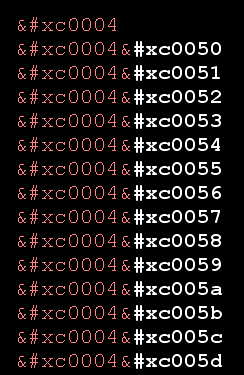
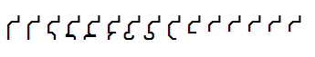
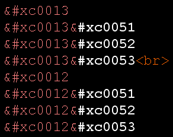
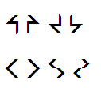
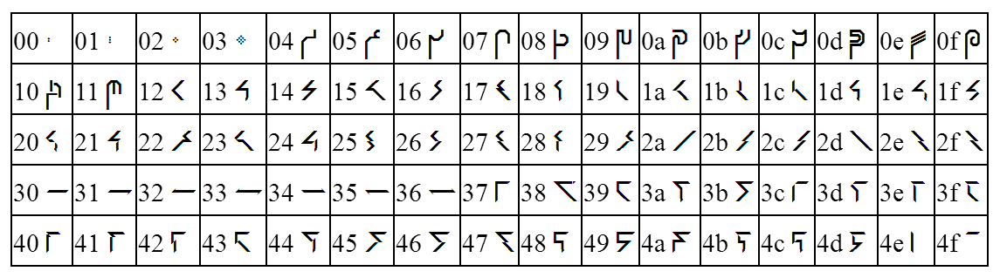
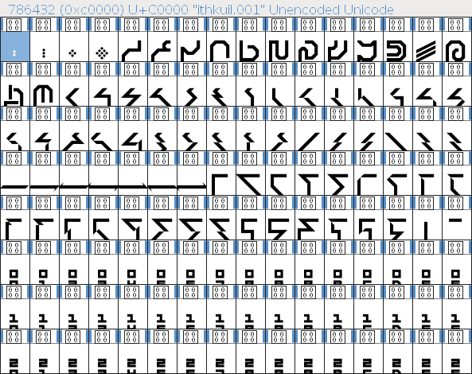

# Ithkey
This repo hosts an [ithkuil](http://ithkuil.net) keyboard compatible with [Ykulvaarlck](https://github.com/Ykulvaarlck)'s ithkuil [font](https://fontstruct.com/fontstructions/show/1337265/ithkuil-3).

## Credits
The writing system and ithkuil by itself are ©2004-2011 by John Quijada. This project only aims to ease writing in ithkuil on a computer.  
The font is all up to Ykulvaarlck, as well as most of examples files. The various keyboard files are made by melopee.

## Install
Install the font in the appropriate way in system.  
As for the keyboard, it is currently disponible on the following operating systems:

### Linux with Xorg and xkb
Copy the the file named `ithkey` to `/usr/share/X11/xkb/symbols/`.
Then, in a terminal, enter the command `setxkbmap ithkey`, which will simply set the xkb map to ithkey.  
If the procedure described above isn't working, one might have _also_ modify the file `evdev.xml` and `base.xml`, which lives in `/usr/share/X11/xkb/rules/`.

Add the following snipet as a children of the `<layoutList>` tag:
```
<layout>
  <configItem>
    <name>ithkey</name>
    <shortDescription>ithkuil keyboard</shortDescription>
    <description>ithkuil combining diacritic keyboard</description>
    <languageList>ithkuil</languageList>
  </configItem>
  <variantList>
    <variant>
      <configItem>
        <name>ithkey</name>
        <description>Ithkey</description>
      </configItem>
    </variant>
  </variantList>
</layout>
```

### MacOS and OSX
Copy the file named `ithkey.keylayout` to either `~/Library/'Keyboard Layouts'/` for only one user, or to `/Library/'Keyboard Layouts'/` for every users (which will also allow the keyboard to appear at login screen after booting).  

After, add the keyboard in the keyboard window from the ‘Preferences and Settings’ window (it will probably be in ‘Others’). Then, choose a keyboard named ‘ithkey’ in the top home bar, in the keyboard list.

### Window
Execute the file named `setup.exe` in the `ithm` folder contained in this repository, which should install the dynamic library suited to the computer system.

## Troubleshootings
Disclaimer: the font is not yet finished, lacks advanced diacritic positioning and kerning. However it's still pretty usable (and useful), enough at least to make a keyboard.

The font makes an heavy uses of combining diacritics, and so the keyboard. At least in some applications, they might not be displayed correctly (where correctly means ‘should change the previous character either by addding a diacritic, changing its shape, or its orientation, depending on the diacritic and its position on after the character’ (more on that later)), and one might instead see a some numbers, a blank space, or either a box with or without a question mark, instead of the character. This might be explained by either a bad unicode support, a bad management of the font or a problem in choosing the font, among other possible problems.

At least, displaying in a browser should still works. To try it, open in a brower the file named `test.html`, which contains. If tables of itkuil letters are displayed, with a bunch of nicely handled diacritics, it probably works.  
If the keyboard doesn't work at all on your system, you may at least use it with a browser for the display part; if the font works in the browser. Just type on an html file with ithkey, which will send raw bytes to the file, and then open it in a browser where the font works.

The mainstream shortcuts used with the control key (or the option key on mac) (like ctrl-c, ctrl-z, ctrl-v or ctrl-q) should work.

If there's any problems, or even solutions to discovered problems, feel free to send a message or submit an issue.

## Functioning
The font encodes the writing system of Ithkuil with a combining diacritic system. So, by leaving up the combinatoric of ithkuil's writing to the diacritics, the numbers of characters required is pretty small compared to all possible ithkuil characters that are existing (see [this project](https://github.com/infusiastic/oltartkhica) to apprehend the extent). Thusly, it's possible to fit all o the chars of the font in a normal laptop keyboard layout.  

The ithkuil writing system uses various diacritics at various positions, as well as different character classes.  
The font works by stacking combining diacritics after a base char; but the combinatoric is expanded via position. Indeed, a combining diacritic will have a different effect if it's the 3rd or the 5th to come after the base char (up to 7 diacritics after one char).  

In the present version, the font uses the unencoded unicode block; from 0xc0000 to 0xc007F (so 128 codepoints); and the keyboard therefore emits those codepoints. Here is the repartition of the char class along this range:  

```
  | 0 1 2 3 4 5 6 7 8 9 A B C D E F
———————————————————————————————————
0 | M M M M N N N N N N N N N N B B
1 | B B 1 1 1 1 1 1 1 1 1 1 1 1 1 1
2 | 1 1 1 1 1 1 1 1 1 1 2 2 2 2 2 2
3 | 3 3 3 3 3 3 3 C C C C C C C C C
4 | C C C C C C C C C C C C C C P P
5 | = = = = = = = = = = = = = = = =
6 | = = = = = = = = = = = = = = = =
7 | = = = = = = = = = = = = = = = @
```

+ M are punctuation marks
+ N are numbers
+ B are tenth powers, that ithkuil's writing system uses instead of a separated symbol for zero
+ 1 are primary chars
+ 2 are secondary chars
+ 3 are tertiary chars
+ C are consontal chars
+ P are placeholder marks
+ = are combining diacritics
+ @ is a special zero-width char that output a grid in the font

Note that the combining diacritics from 0xc0071 to 0xc007E aren't currently assigned, but kept though for a future use (and 128 uses to be a more memorable number).  

Below is a table describing the diacritics that a char from a certain class can handle:
```
1  | + '   ,        ^ V >
2  |   '   ,  /' /, ^ V >
3  |          /' /, ^ V >
C  | + -'  ,        ^ V >
P| |    '  ,        ^ V >
P- |   -' -,        ^ V >
N  |       ,
```

+ \+ is rotation
+ '  is top tail
+ ,  is bottom tail
+ /' is top wing
+ /, is bottom wing
+ ^  is top diacritic
+ V  is low diacritic
+ \>  is mid diacritic
+ -' is a variant of top tail (not totally 'top', but still referred by that)
+ -, is a variant of low tail (idem)

Note that 0x0050 is a null diacritic, i.e. it has no effect except incrementing the position (useful and used for leaving a position in default value).

## Examples
To illustrate how the combining system works, let's look at those pictures where the code points are directly shown in html escape code.  

Typing  
  
will be rendered as:  


&nbsp;
Typing  
  
will be rendered as:  


One may also interested in the following tables, which explicits the encoded and the encoding:




More examples can be found in the `test.html` file, to be opened with a browser. This file presents also some tests the max range of diacritic uses for one diacritic slot after a base char, it may be interesting to see them to understand how work the font.

## Logic of the keyboard
Here is the current maps of the keyboard. The numbers to the right precise the row level, and the letters are the same abbreviations as used before, only in lowercase for convenience.

(The keymaps are represented here for an british physical keyboard, which [slightly differs](https://imgur.com/EIUutp9) from the us one; there are yet other models, like [this one](https://imgur.com/8HHMLnZ). The british version has an additional key that the us has not, but it is not essential.)

```
None level
@============   5
 111111111===   4
 111111111===   3
 m111111mmm     2

Shift level
@nnnnnnnnnnbb   5
 ccccccccc==b   4
 ccccccccc==b   3
 mccc|ccmmm     2

Altgr level
2222223333333   5
 ============   4
 ===========-   3
 ==========     2
```

Even if the 33 modifiers can be found on the altgr level (also known as ctrl+alt level), they are repeated on the base level (the 18th first ones, so 0xc0050 to 0xc0061) and on the shift level (the 4th first ones, so 0xc0050 to 0xc0053); in order to not use the altgr level every two keystrokes, since the ithkuil script heavily uses those diacritics.  

On the base level the primary chars are ordered left to right, top to bottom, by the order given in [the Chapter 11](ithkuil.net/11_script.html), which is also the order of Cases.  

On the shift level, the consontal chars are mapped to the keys, adapting the us qwerty. Here is the map, with the [official transcription in roman alphabet](ithkuil.net/01_phonology.html):
```
@ 1  2  3  4  5  6  7  8  9  e1  e2  e4
  q' w  ţ  r  t' y  č' k' p' 52  53  e8
  q  s  c  f  t  h  č  k  p  50  51  ef
  p3 x  c' š  |  ň  m  p0 p1 p2
```

(To represent ithkuil sigils in ascii, some additions to the romanization were made, namely  
+ e1 is 10, e2 is 100, e4 is 10^4, e8 is 10^8, ef is 10^16
+ p0 is 0xc0000, p1 is 0xc0001, p2 is 0xc0002, p3 is 0xc0003
+ 50, 51, 52, 53 are obviously 0xc0050, 0xc0051, 0xc0052, 0xc0053; respectively

)
